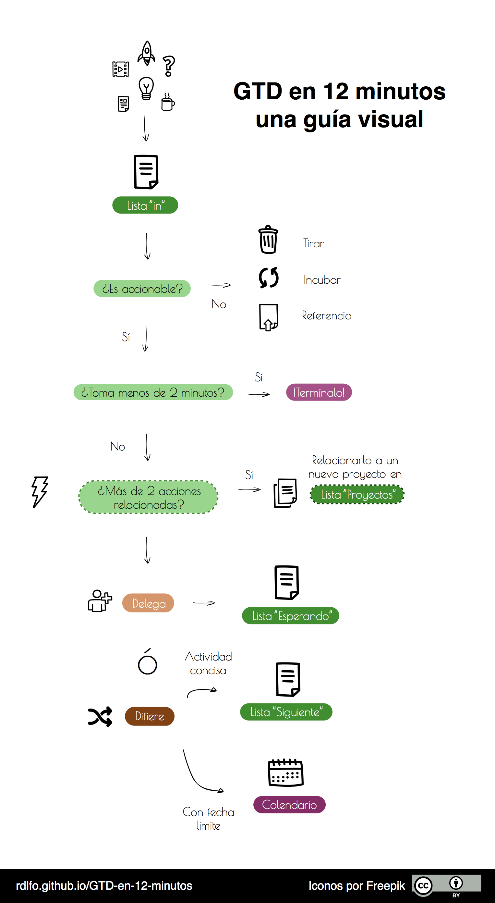
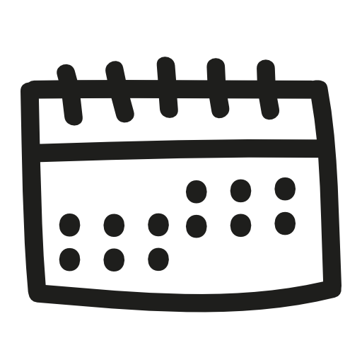

# GTD en 15 minutos - Una guía práctica

## Tabla de contenido
* [¿Qué es "GTD"?][¿Qué es "GTD"?]
* [La lista "In"][La lista "In"]
* [La lista "Siguiente"][La lista "Siguiente"]
* [La lista "Esperando"][La lista "Esperando"]
* [La lista "Proyectos"][La lista "Proyectos"]
* [Contextos][Contextos]
* [Contextos de Agenda][Contextos de Agenda]
* [La lista de "Algún día / Quizás"][La lista de "Algún día / Quizás"]
* [Calendario][Calendario]
* [Revisión Semanal][Revisión Semanal]
* [Lista de Disparadores][Lista de Disparadores]
* [Asegurandote de que funcione][Asegurandote de que funcione]
* [Herramientas][Herramientas]
* [Sobre esta guía][Sobre esta guía]

## ¿Qué es "GTD"?

GTD significa "Getting Things Done" o en español, "Organizate con eficacia". GTD
es un método de trabajo que sirve para gestionar tus ideas y pendientes.
El objetivo de GTD no es solamente ser una lista de tareas, sino
un sistema simple e integral que te permita avanzar y completar tus proyectos.

Con el podrás monitorear y completar ideas como "Conquistar el mundo", o
actividades tales a "Hablar con Katia a las 10:15 a.m. para discutir
sobre nuestro nuevo proyecto millonario".

El sistema GTD asume que nuestro inconsciente es malo para
pensar *activamente* que es lo que deberíamos estar haciendo. Por ejemplo: si
tienes hambre y no hay comida en tu casa, posiblemente te darás cuenta muy
tarde que había que hacer despensa. GTD te dará una forma de trabajo que
hará que esto no vuelva a ocurrir.

Todos tenemos actividades en las que debemos, y algunas, en las que queremos
trabajar, pero estas ideas las dejamos olvidadas en algún lado y permitimos
al azar y a las ganas de recordarnoslas.

[Jessica Kerr](http://jessitron.com/) lo dijo perfectamente:

> Imagina que tu cerebro es un pizarrón. ¿Lo tienes cubierto de listas y mensajes
> de NO BORRAR? ¿Te quedará algo de espacio para dibujar libremente y jugar con
> tus ideas?

El principio de GTD es darte un plan para convertir tus tareas en *acciones
concretas*.

Cuando te acostumbres a usarlo y confiar en el, empezarás a sentirte
más en control de tu vida. Esto reducirá tus niveles de estrés y te conseguirá
tiempo para relajarte, sin mencionar que te acercará a terminar lo que deseas.

GTD es tan simple y sencillo que puedes utilizar lápiz y papel para manejarlo.

Para comenzar, necesitarás crear cinco listas distintas:
1. In
2. Siguiente
3. Esperando
4. Proyectos
5. Algún día / Quizás

Estas listas son la columna vertebral del sistema GTD y necesitan ser revisadas
frecuentemente. Puedes agregar además de esto un calendario o agenda que te
permita anotar tareas que deben ser cumplidas en una fecha en específico.

## La lista "In"
En esta lista capturarás todas las ideas, actividades, preguntas y pendientes
que surjan en tu día. Puede ser una orden de tu jefe, un trabajo, una idea
para tu casa ... Toda actividad pasa primero por esta lista.

Si es tu primera vez en que usas GTD, deberás de vaciar todos tus pendientes
y actividades aquí.

### Procesando tus actividades
Si apenas empezaste a usar GTD entonces probablemente tengas muchas actividades
en tu lista. El procesarlas puede tomarte un tiempo, pero una vez que termines
deberás de procesar esta lista continuamente.

Para iniciar necesitas preguntarte si la idea que estás revisando es
*accionable*. Es decir: ¿puedes hacer algo con el pendiente? Si la respuesta
es *NO* vas a hacer una de las siguientes cosas:

a) Borrarlo.
b) Guardarlo como material de referencia.
c) Agregarlo a la lista de Algún día / Quizás.
d) o Incubarlo.

El incubarlo se refiere a las actividades que te gustaría recordar en una
fecha en el futuro. Para incubar, solo anota la idea en tu calendario en el día
qué crees que lo aprovecharás. Ej. Releer el artículo fisica cuantica la
próxima semana.

Si la entrada en tu lista *ES* accionable (se puede hacer algo al respecto)
hazte y responde la pregunta ¿Cuál es el siguiente paso?
Este paso deberá de ser una acción en *concreto*.

Por ejemplo: Si tuvieras una actividad marcada como "Avanzar en el trabajo de
investigación" deberás de convertirla a una más específica cómo "Citar
fuentes en formato APA."

Esta es una de las reglas más importantes del método GTD. El siguiente paso
debe ser siempre concreto para poder avanzar en tus pendientes. El tomarte
unos minutos para redactarlo de esta manera removerá en el futuro parte de tu
resistencia a iniciar el trabajo.

Una vez concretada, ¿es posible terminarla en dos minutos? Si es así entonces no
pierdas el tiempo y complétala de una vez. Entre menos pendientes tengas en tu
lista, mucho mejor.

Si la tarea fuera más larga, entonces solo queda hacer uno de los siguientes:

a) Delegar
b) Diferir

Delegar es dejar la actividad a cargo de otra persona y esperar el resultado.
Si decides delegar, agrega la actividad en tu lista de Esperando.

Diferir implica que la actividad no puede realizarse en este momento y la
atenderás en el futuro, idealmente la realizarás lo más pronto posible.
Si escoges diferir, agrega la tarea en tu lista de "Siguiente".
Es normal que la mayoría de tus tareas las termines añadiendo a esta lista.

Por último, si la tarea en cuestión necesita más de una acción para completarse
deberás agregar una entrada a tu lista de "Proyectos" que agrupe esas tareas.
Hablaremos más sobre esto en los siguientes apartados.

Para resumir:

## La lista "Siguiente"

Esta es la lista en la que se añaden las actividades que *Siguen*. En otras
palabras, esta lista contiene actividades que "deben hacerse lo antes posible".
Debes de revisar esta lista en tus tiempos muertos.

## La lista "Esperando"

Esta lista solo será usada cuando delegues un trabajo. Escribe en ella las
actividades o entregas que estés esperando. Asegúrate de anotar la fecha en
la que cada entrada haya sido agregada a la lista. Esto te permitirá saber
cuánto tiempo has estado esperando una tarea.

## La lista "Proyectos"

Cualquier tarea que requiera más de una acción para completarse puede
considerarse como un Proyecto. En si, esta es una lista con *los
nombres de tus proyectos*. Se recomienda que a cada proyecto le agregues una
descripción breve sobre sus detalles y los resultados que esperas al
final de este.

Cuando revises tu lista de proyectos, asegurate que al menos exista una acción
por proyecto dentro de tu lista de "Siguiente". De esta manera el sistema te
asegura que tus proyectos no sean olvidados y continúes avanzando en ellos.
Esto es crucial en el sistema GTD.

## Contextos

Un contexto es una etiqueta que puedes agregar a las actividades de la lista
"Siguiente". Esta etiqueta te ayuda a resaltar donde o que herramienta necesitas
para poder completar esa actividad.

Los contextos son útiles porque permiten identificar rápidamente que necesitamos
para trabajar en una tarea.

### Ejemplos de tareas y sus contextos

| Actividades                                 | Contexto        |
|---------------------------------------------|-----------------|
| Escribir un libro de Informatica            | @computadora    |
| Comprar regalos de navidad para mis amigos  | @tienda         |
| Regresar el libro de Programación básica    | @biblioteca     |

(Puedes usar colores o escribir un símbolo como (# o @) para identificar estas
etiquetas en tus listas.)

La cantidad de contextos que deberás tener depende mucho de tu forma de trabajo.
Como regla de oro: lo importante es poder comprender a primera vista
cuales son tus posibles actividades dependiendo de donde estes y que tengas a la
mano.

Evita llenarte de contextos superfluos o que solo usarás una vez. Se recomienda
tener un contexto "@libre" para etiquetar las tareas que puedas hacer sin
importar donde estés.

### Contextos de Agenda

Los contextos también puedes usarlos para identificar a tus contactos. Si
delegas seguido o trabajas colaborativamente, manejar contextos como "@Javier"
te permitirán identificar las actividades que necesitas discutir cuando lo
veas.

## La lista de "Algún día / Quizás"

Esta lista reúne las ideas parecidas a "empezar un culto" o "aprender una
lengua muerta" (asumiendo que no te interesa hacerlo eso en este momento).

Ideas que te gusten, pero que no tienes la motivación para hacer en estos
momentos van aquí. Algunas veces, habrán otras prioridades en tu vida y no
podrás prestarle atención a ciertas ideas hasta fechas posteriores, para
que esas ideas no sean olvidadas se debe de revisar semanalmente esta lista.

## Calendario

El calendario es *exclusivamente* para las cosas que debes de realizar en una
fecha en específico. El calendario será mucho más útil si solamente te dice
qué es lo que necesitas hacer en cada fecha dada.

No confundas actividades que quieres hacer con las que debes de hacer. Si es
lo primero, y no hay fecha limite natural, estas deben de ir en tu lista de
"Siguiente".

## Revisión Semanal

Uno de los factores críticos para hacer que funcione el sistema GTD es la
revisión semanal. No eres un robot y olvidarás cosas de momento en momento.

Completarás una actividad del proyecto que tanto quieres, pero quizas olvides
agregar una nueva tarea. Podrias olvidar quitar actividades que ya hiciste o bien,
que no has completado en semanas porque ya no son prioridad.
Esto es de lo más normal y para eso es que existe la revisión.

Para asegurar que todo funcione como se debe, se sugiere que tomes al menos
treinta minutos cada fin de semana, el día viernes o sábado, para analizar tus
listas.

En tu revisión deberás de hacer lo siguiente:
* Asegurar que cada uno de tus proyectos tenga una acción en "Siguiente". Esta
actividad *debe* de ser algo que tu *realmente* quieras o necesites
hacer la semana venidera. Si no, mueve la actividad o el proyecto entero a la
lista de "Algún día / Quizás". Se honesto contigo, y si no crees que vayas a
cumplirlo deberás bórralo y continuar con lo que realmente te es importante.

* Revisar tu lista "Algún día / Quizás" y verificar si alguno de tus proyectos o
ideas deben de ser movidos a tu lista de "Proyectos" o "Siguiente". Si vas
a crear un nuevo Proyecto, asegurate que agregues su primer acción
*concreta* en la lista de "Siguiente".

## Lista de Disparadores

Esta es una lista opcional que contiene palabras que te "disparan" a pensar en
ideas que aún no hayas capturado en tu lista de "In". Puedes revisarla una
vez a la semana en tu tiempo de revisión.

## Asegurandote de que funcione

*Es importante que tengas bien definidos los alcances de la lista "Siguiente".
Tu lista *Siguiente* debe de contener tareas específicas y *concretas* para
hacerlas en la primer oportunidad que tengas.

*No te atiborres de contextos. Solamente usa los necesarios para las tareas
importantes.

*Tus herramientas deben de ser *divertidas para usar* pero no *demasiado*. No
uses ninguna herramienta que te distraiga del objetivo principal que es lograr
tus tareas y tampoco uses ninguna herramienta que te dificulte o te haga más
difícil tomar acción.

## Herramientas

Hay varias herramientas que puedes utilizar para facilitar el manejo de tu sistema
de listas. Puede variar desde lo análogo hasta lo digital.
Aquí hay dos sugerencias recomendadas para iniciar a trabajar con GTD. Recuerda,
la mejor herramienta siempre es aquella que se acomoda a lo que tu
necesitas.

### Lapíz y Papel
*Pros:*
* Solución barata y simple
* No necesita una pila para funcionar
* Es más natural

*Contras:*
* Es molesto encontrar las listas si no tienes separadores
* Si se te pierde no tienes copias
* Podrías olvidar traerla a donde estés

### Wunderlist [Android](https://play.google.com/store/apps/details?id=com.wunderkinder.wunderlistandroid&hl=es_419),  [iOS](https://itunes.apple.com/us/app/wunderlist-to-do-list-tasks/id406644151?mt=8)

*Pros:*

* Gratis
* Se sincroniza con todos tus dispositivos
* Interfaz atractiva

*Contras:*

* Necesitas un celular
* Necesitas batería para usarla

## Sobre esta guía

Esta guía fue escrita para servir como una referencia simple y pragmática de
GTD. Está elaborada para ser corta y concisa obviando cierta información del
libro y el autor original.

Si quieres una visión completa de lo que es el método GTD te recomendamos
leer el libro de David Allen *["Organizate con eficacia"](http://www.amazon.com/Organizate-eficacia-Spanish-Edition-David/dp/849662708X)*

La información en este sitio fue escrita en inglés por Erlend Hamberg y fue
adaptada por Rodolfo Treviño. Puedes encontrar el sitio original (aquí)[hamberg.no/gtd/].

Las ilustraciones mostradas en este sitio fueron dibujadas por el grupo
[Freepik](http://www.freepik.com).

Esta obra y todo su contenido está bajo una licencia de
[Creative Commons de Reconocimiento 4.0 Internacional](http://creativecommons.org/licenses/by/4.0/).

La guía fué escrita en Markdown y se utiliza
[pandoc](http://pandoc.org/) para crear el HTML.

Por ultimo:
¡Platica conmigo en [twitter](www.twitter.com/r_dlfo)!
Comentarios y mejoras sobre esta guía son completamente bienvenidos.

